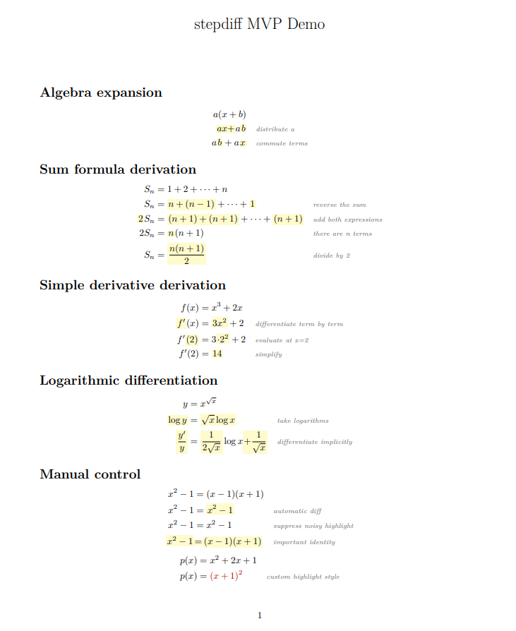

# stepdiff

`stepdiff` is a LuaLaTeX package for writing step-by-step mathematical derivations with automatic visual diffing between consecutive lines. It is designed for lecture notes, worked solutions, Beamer slides, and explanatory documents where the author wants changed parts of a derivation to stand out while keeping the source concise.

LuaLaTeX is required. `stepdiff` uses Lua for tokenization and diffing, so it will not work with pdfLaTeX.

## Status

Current released version: v0.2.0 MVP. Development has started for v0.3.0.

`stepdiff` is usable for simple derivations, examples, and experimentation, but it is not yet a full CTAN-ready package.



## What it does

- Provides a `stepdiff` math environment and a `\step` command.
- Typesets derivations as aligned display math.
- Aligns each step at the first literal `=` when one is present.
- Compares each step to the previous step with token-level visual diffing.
- Uses a math-atom tokenizer for common constructs such as scripts, fractions, roots, function calls, dots, and parenthesized atoms.
- Highlights changed chunks using `\SDchanged{...}`.
- Places optional `reason={...}` annotations in a separate right-hand column.
- Provides manual controls for noisy cases: `diff=auto`, `diff=false`, `diff=none`, and `diff=all`.

## What it does not do

- It does not check whether the mathematics is correct.
- It does not prove equality.
- It does not use a computer algebra system.
- It does not classify steps as expansion, factorization, differentiation, simplification, or any other mathematical operation.
- It does not perform semantic math parsing. The diff is visual and token-based.

## Installation

For local use, copy these files into your project or somewhere TeX can find them:

```text
stepdiff.sty
stepdiff.lua
```

Then compile documents with LuaLaTeX:

```bash
lualatex your-file.tex
```

From this repository, build the examples with:

```bash
make demo
make examples
make test
make lua-test
```

Generated PDFs are ignored by Git. Rebuild them locally with the Makefile.
Rendered screenshots are not generated automatically, but they can be added
under `docs/assets/` later.

## Minimal example

```latex
\documentclass{article}
\usepackage{xcolor}
\usepackage{stepdiff}

\begin{document}

\[
\begin{stepdiff}
\step{a(x+b)}
\step[reason={distribute a}]{ax + ab}
\step[reason={commute terms}]{ab + ax}
\end{stepdiff}
\]

\end{document}
```

Lines containing `=` are aligned at the first equals sign. Reasons are placed in a separate annotation column, visually similar to:

```latex
\begin{aligned}
left & = right && \text{reason}
\end{aligned}
```

## Screenshot

A screenshot or rendered demo image can be added here later, for example:

```markdown

```

For now, run `make examples` and open the generated PDFs in `examples/`.

## Manual control

Automatic token-level diffing is approximate, so each step can choose a diff mode:

```latex
\step[reason={expand}, diff=auto]{x^2 + 2x + 1}
\step[reason={too noisy}, diff=false]{x^2 + 2x + 1}
\step[reason={also no diff}, diff=none]{x^2 + 2x + 1}
\step[reason={important final formula}, diff=all]{x^2 + 2x + 1}
```

- `diff=auto` is the default. It compares the current step to the previous step using token-level visual diffing.
- `diff=false` disables automatic highlighting for that line.
- `diff=none` is equivalent to `diff=false`.
- `diff=all` highlights the whole mathematical line and keeps the reason annotation.

Use `diff=false` when automatic highlighting is noisy. Use `diff=all` when an important step should be emphasized as a whole.

## Customization

The default highlighting and reason styling are intentionally simple. Redefine these hooks in your preamble:

```latex
\renewcommand{\SDchanged}[1]{\color{red}{#1}}
\renewcommand{\SDreason}[1]{\normalfont\scriptsize\itshape #1}
```

`\SDchanged{...}` receives changed math content and should remain safe in math mode. `\SDreason{...}` styles reason text inside the annotation column.

Two built-in environment styles are available:

```latex
\begin{stepdiff}[style=highlight]
...
\end{stepdiff}

\begin{stepdiff}[style=underline]
...
\end{stepdiff}
```

The recommended styles for v0.2.0 are the default yellow highlight and the underline style for documents where background color is undesirable. Users can still redefine `\SDchanged` directly for custom colors or print-oriented styles.

Reasons can be hidden and shown globally:

```latex
\SDhidereasons
\SDshowreasons
```

## Examples

The repository includes:

- `examples/demo.tex`: combined demonstration.
- `examples/algebra.tex`: expansion and factorization examples.
- `examples/calculus.tex`: derivative and logarithmic differentiation examples.
- `examples/manual-control.tex`: diff modes and customization examples.
- `examples/beamer-demo.tex`: minimal Beamer frame using `stepdiff`.

Compile one example directly from the repository root:

```bash
lualatex -output-directory=examples examples/algebra.tex
```

Compile all examples:

```bash
make examples
```

Run compile-only regression tests and Lua-side unit tests:

```bash
make test
```

Run only the Lua-side unit tests:

```bash
make lua-test
```

## Limitations

- Diffing is purely token-level visual diffing.
- Math atom tokenization is improved in v0.2.0, but it is still not a full LaTeX math parser.
- `stepdiff` does not check mathematical correctness.
- `stepdiff` does not use a CAS.
- Highlighting is approximate and may choose unintuitive chunks.
- Removed tokens are not shown because only the current line is rendered.
- Complex LaTeX macros may not always be highlighted perfectly.
- Commands with braced arguments, such as `\frac{...}{...}`, are usually kept as one token to avoid invalid highlighted output.
- Alignment currently uses only the first literal `=` in each step.
- Relation symbols such as `\le`, `\ge`, and `\approx` are not yet alignment targets.

## Roadmap

- Continue improving the math atom tokenizer for more macros and delimiter patterns.
- Add relation-aware alignment for symbols such as `\le`, `\ge`, and `\approx`.
- Add more built-in color themes for lecture notes, print, and slides.
- Improve Beamer overlay support for revealing derivation steps incrementally.
- Add more robust examples and package tests.
- Explore a future optional semantic mode while keeping the current visual mode simple and predictable.
- Add packaging metadata for CTAN-style distribution.

## License

MIT License. See `LICENSE`.
